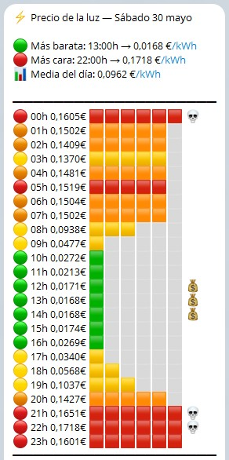

<div align="center">

# ⚡ PrecioLuz Bot

[](https://creativecommons.org/licenses/by-nc-sa/4.0/)
[](https://www.python.org/)
[](https://www.docker.com/)
[](https://t.me/)

**Tu bot personal de precios de la luz en España** 🇪🇸💰

</div>

---

## 📸 Captura del bot

<p align="center">
  
</p>

---

## ✨ Características

- 📊 **Notificación diaria** a las 20:15h con los precios del día siguiente (PVPC)
- 🔍 **Consulta manual** con `/precio` — hoy o mañana según la hora
- 📈 **Resumen visual**: hora más barata, más cara, media y barras proporcionales
- 👥 **Multi-suscriptor**: varias personas pueden recibirlas notificaciones
- 🐳 **Dockerizado**: arranca en un comando y olvídate

## 🚀 Instalación rápida

```bash
# 1. Clona el repo
git clone https://github.com/Hugopvigo/PrecioLuz.git
cd PrecioLuz

# 2. Configura las variables
cp .env.example .env
# Edita .env con tus tokens

# 3. Arranca 🚀
docker compose up -d
```

## 🔑 Variables de entorno

| Variable | Descripción | Por defecto |
|---|---|---|
| `TELEGRAM_BOT_TOKEN` | Token del bot de [@BotFather](https://t.me/BotFather) | *(obligatoria)* |
| `ESIOS_API_TOKEN` | Token de la API ESIOS de REE | *(obligatoria)* |
| `TZ` | Zona horaria | `Europe/Madrid` |
| `NOTIFY_HOUR` | Hora de notificación diaria | `20` |
| `NOTIFY_MINUTE` | Minuto de notificación diaria | `15` |
| `LOG_LEVEL` | Nivel de logging | `INFO` |

## 💬 Comandos del bot

| Comando | Descripción |
|---|---|
| `/start` | 🔔 Suscribirse a notificaciones diarias |
| `/stop` | 🛑 Darse de baja |
| `/precio` | 🔍 Consulta manual del precio de hoy o mañana |
| `/ayuda` | ❓ Muestra los comandos disponibles |

> **Lógica de `/precio`:** de 00:00 a 19:59 muestra los precios de hoy; de 20:00 a 23:59 muestra los de mañana (si ya están publicados).

## 📊 Datos

Los precios se obtienen de la [API oficial ESIOS de Red Eléctrica](https://api.esios.ree.es). Los valores se muestran en **€/kWh** (la API devuelve €/MWh, se divide entre 1000).

## 📄 Licencia

[Creative Commons BY-NC-SA 4.0](https://creativecommons.org/licenses/by-nc-sa/4.0/) — Uso libre con atribución, no comercial, obras derivadas bajo la misma licencia.

---

---

<div align="center">

**Desarrollado por [Hugo Perez-Vigo](https://hugopvigo.es)** · [@hugopvigo](https://x.com/hugopvigo)

[](https://github.com/Hugopvigo)

</div>
